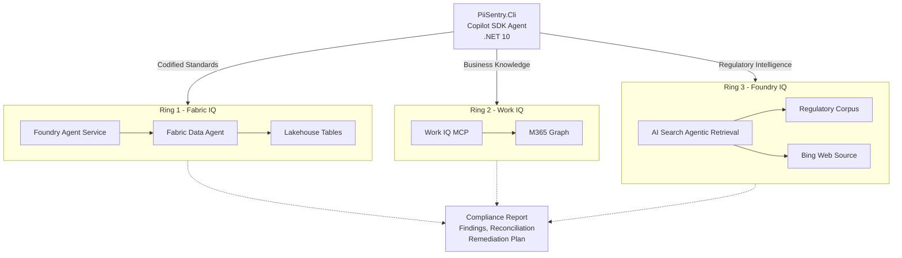

# PII Sentry

PII Sentry is a .NET 10 CLI that scans application source code for PII/PHI compliance violations using the GitHub Copilot SDK.

## Problem

PII/PHI handling rules are scattered across codified standards, in-flight business policies, and evolving regulations. This leaves blind spots that manual reviews miss.

## Solution

PII Sentry performs a concentric-ring compliance scan. It reads source code, queries three intelligence rings in parallel, and produces a unified report with grounded findings, cross-ring reconciliation, and a file-grouped remediation plan.

- **Fabric IQ** (Ring 1) - Queries codified standards from a Fabric Lakehouse via Foundry Agent Service
- **Work IQ** (Ring 2) - Surfaces business knowledge from M365 via native MCP server
- **Foundry IQ** (Ring 3) - Retrieves regulatory intelligence from HIPAA, GDPR, and CCPA documents via Azure AI Search agentic retrieval

Each ring grounds its findings with citations. The output is a Markdown report with a file-grouped remediation plan designed for coding assistant handoff.

## Prerequisites

- .NET 10 SDK
- Azure subscription with:
  - AI Foundry resource + project
  - Azure AI Search (S0+) with agentic retrieval knowledge base
  - Fabric capacity (F4+) with workspace, lakehouse, and Data Agent
  - Storage account for regulatory document blob storage
- GitHub Copilot license (for the Copilot SDK)
- Node.js 18+ (for Work IQ MCP via npx)

## Setup

1. **Infrastructure:** `cd infra && terraform init && terraform apply`
2. **Fabric:** Create a lakehouse, load CSV data, and configure the Data Agent. Sample compliance data is provided in `demo-data/lakehouse/` for evaluation. Enterprises should replace this with their own PII/PHI data categories, handling requirements, and compliance controls.
3. **Foundry Agent:** Run `infra/scripts/create-foundry-agent.sh` to create the Foundry agent with FabricTool
4. **Regulatory Docs:** Run `infra/scripts/upload-regulatory-docs.sh` to upload to blob storage for AI Search indexing. Sample HIPAA, GDPR, and CCPA excerpts are provided in `demo-data/regulatory/`. Enterprises should add their own regulatory corpus.
5. **Fabric Auth (CMK):** If the subscription enforces Customer-Managed Keys on Fabric, run:
   ```powershell
   .\infra\scripts\Setup-FabricAuth.ps1 `
       -SubscriptionId "<sub-id>" -ResourceGroup "<kv-rg>" `
       -KeyVaultName "<kv-name>" -AdminUpn "<admin@tenant.onmicrosoft.com>"
   ```
   This grants the Fabric service principal access to the CMK in Key Vault. See script for details.
6. **Configuration:** Copy `src/PiiSentry.Cli/appsettings.json` and fill in endpoint values

## Usage

```bash
# Scan with all rings, output as Markdown
pii-sentry scan ./src/PiiSentry.DemoApp --ring all --output report.md

# Scan with specific ring
pii-sentry scan <path> --ring fabric --output report.json

# Output formats: .md (Markdown, recommended), .html (HTML), .json (JSON)
```

### Installation

**From GitHub Packages (recommended for enterprise distribution):**

```bash
dotnet tool install --global PiiSentry.Cli \
  --add-source https://nuget.pkg.github.com/mjhoffmeister/index.json
```

**From local build:**

```bash
dotnet pack src/PiiSentry.Cli -c Release -o ./nupkg
dotnet tool install --global --add-source ./nupkg PiiSentry.Cli
```

### Configuration

The CLI reads configuration from environment variables or `appsettings.json`:

| Variable | Description |
|----------|-------------|
| `FOUNDRY_PROJECT_ENDPOINT` | AI Foundry project endpoint |
| `FOUNDRY_FABRIC_AGENT_ID` | Pre-created Foundry agent ID |
| `AI_SEARCH_ENDPOINT` | Azure AI Search endpoint |
| `AI_SEARCH_KNOWLEDGE_BASE` | Knowledge base name |
| `WORKIQ_TENANT_ID` | M365 tenant ID for Work IQ |

## Architecture



See [architecture.md](architecture.md) for detailed component descriptions and IQ workload mapping.

## Responsible AI

See [rai-notes.md](rai-notes.md) for data minimization, transparency, and human oversight practices.

## Repository Structure

```
src/PiiSentry.Cli/       - .NET 10 CLI (Copilot SDK agent, ring tools, report generation)
src/PiiSentry.Core/      - Shared models, contracts, report generation
src/PiiSentry.DemoApp/   - Intentionally non-compliant demo app for testing
infra/                   - Terraform (AzApi) modules for Azure infrastructure
demo-data/               - Lakehouse seed CSVs, regulatory text excerpts
docs/                    - Documentation, architecture diagram, RAI notes
presentations/           - PiiSentry.pptx submission deck
AGENTS.md                - Coding agent instructions
mcp.json                 - Work IQ MCP server configuration
```
