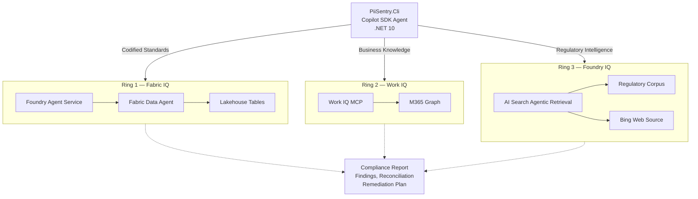

# Architecture

PII Sentry uses a **concentric-ring model** where each ring queries a different Microsoft IQ workload, providing progressively broader context for PII/PHI compliance analysis.

## Concentric-Ring Diagram



## IQ Workload Mapping

PII Sentry integrates all three Microsoft IQ workloads to provide layered compliance intelligence:

| Ring | IQ Workload | What It Provides | Transport |
|------|-------------|------------------|-----------|
| **Ring 1** | **Fabric IQ** | Codified organizational standards — PII/PHI categories, encryption mandates, retention policies, data flow rules | Fabric Data Agent via Foundry Agent Service (`FabricTool`). CLI creates a disposable thread on a pre-provisioned Foundry agent. |
| **Ring 2** | **Work IQ** | Uncodified business knowledge — recent policy decisions, meeting notes, email threads that haven't been formalized into org standards yet | Native MCP server (`npx -y @microsoft/workiq mcp`) managed by Copilot SDK via `SessionConfig.McpServers`. Runs under the user's M365 identity. |
| **Ring 3** | **Foundry IQ** | Regulatory intelligence — HIPAA, GDPR, CCPA/CPRA text plus real-time enforcement actions and guidance via Bing grounding | Azure AI Search agentic retrieval REST API (`POST /knowledgebases/{name}/retrieve`). Knowledge base with blob + Bing knowledge sources, gpt-4o query planning. |

### Why Three Rings?

Each IQ workload captures a different layer of compliance truth:

- **Fabric IQ** (Ring 1) holds what the organization has **codified** — these are the official, structured rules in lakehouse tables. They may be slightly outdated.
- **Work IQ** (Ring 2) holds what the organization **knows but hasn't codified** — a Word doc saying "switch to AES-256" or a meeting transcript about new state genetic privacy laws. These are more current than the lakehouse but less authoritative.
- **Foundry IQ** (Ring 3) holds what the **regulators actually require** — the ground truth from HIPAA, GDPR, and CCPA text, plus real-time updates. This catches requirements that neither the org standards nor the informal docs cover (e.g., GDPR Article 35 DPIA requirements).

The **reconciliation pass** compares findings across all three rings to surface gaps: requirements that exist in regulations but aren't tracked anywhere in the organization, or informal decisions that should be codified into the lakehouse.

## Two-Layer Agent Model

| Layer | Where It Runs | What It Does |
|-------|---------------|--------------|
| **Copilot SDK Agent** (local) | In-process inside `PiiSentry.Cli` | Reasoning loop — reads code, calls ring tools, cross-references findings, produces the report. Uses `CopilotClient` + `AIAgent` abstraction. |
| **Foundry Agent** (remote) | Azure Foundry Agent Service | Pre-created server-side resource wrapping the Fabric Data Agent via `FabricTool`. The CLI references a stable agent ID and creates a disposable thread per scan. Used by Ring 1 only. |

## Runtime Call Flow

```
PiiSentry.Cli
 ├─ Copilot SDK Agent (in-process reasoning)
 │   ├─ [built-in file ops]           → local filesystem (approved via OnPermissionRequest)
 │   ├─ query_fabric_data_agent       → Foundry Agent Service (pre-created agent + new thread)
 │   │                                   └─ FabricTool → Fabric Data Agent (Azure identity)
 │   ├─ [Work IQ MCP tools]           → native MCP via SessionConfig.McpServers
 │   │                                   (SDK-managed child process, user's M365/Copilot identity)
 │   └─ query_foundry_iq              → AI Search agentic retrieval REST API (direct, Entra token)
 │
 └─ Report generation (local) → Markdown, HTML, or JSON
```
